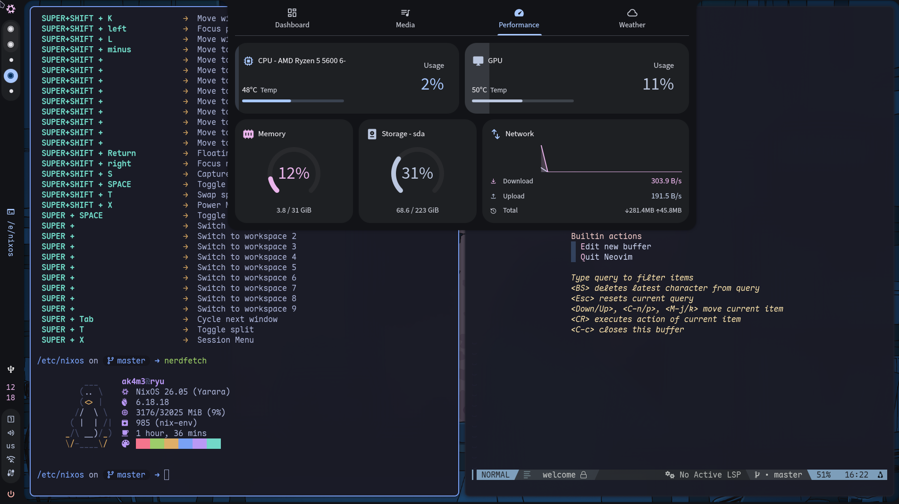
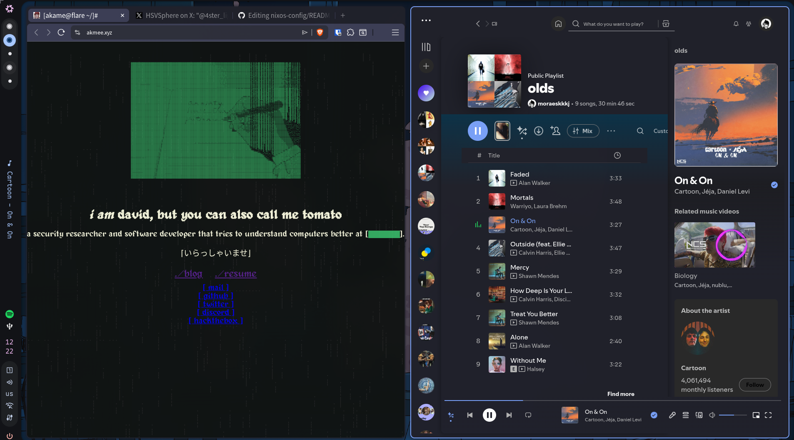
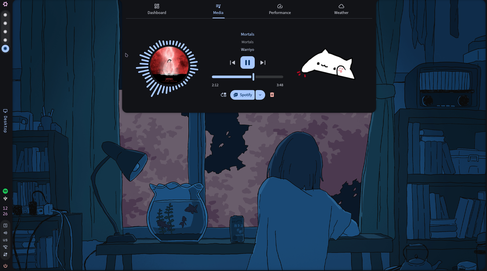

# NixOS config

Here lies the configuration of my system using NixOS, my focus is studying/working on security and programming. This config is for a single host (for now) which is my desktop.

## Showcase

### Ryu, main desktop:

### Sora, Laptop

coming soon

## Tooling

- hyprland (window manager)
- caelestia-shell (desktop shell)
- ghostty (terminal emulator)
- fish (shell)
- yazi (file manager)
- Neovim + nvf (text editor)
- brave (browser)

## Structure

- `flake.nix` - inputs and host inventory.
- `hosts/` - per machine `configuration.nix`, `hardware.nix` and secrets.
- `homes/` - programs specific configuration. (Shell, Terminal, Browser and such)
- `server-modules/` - Not being used at the moment.
- `themes/` - themes files created using stylix and imported by the `hosts/var.nix` file.
- `homes/programs/nvf/` - neovim + nvf config

hosts:

- `ryu` - main desktop
- `sora` - thinkpad laptop (will be added later)
- `server` - my dell laptop which i use as server

## Special Thanks

[anotherhadi/nixy](https://github.com/anotherhadi/nixy)

[harbinger/hyprdots](https://github.com/BinaryHarbinger/hyprdots)

[gmkonan/flake](https://github.com/GMkonan/flake)
